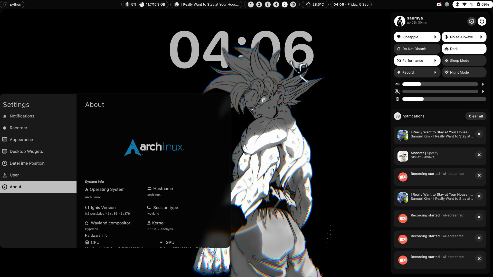
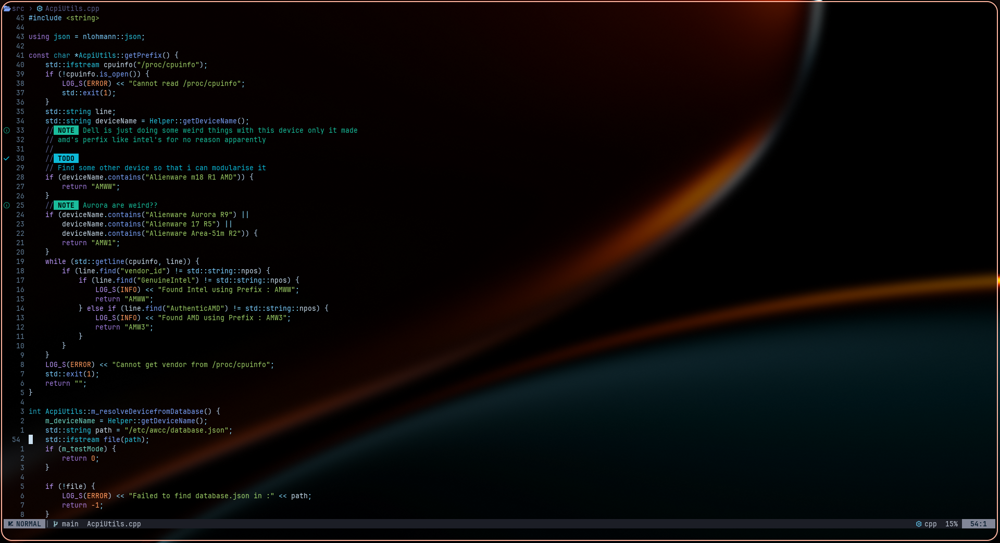
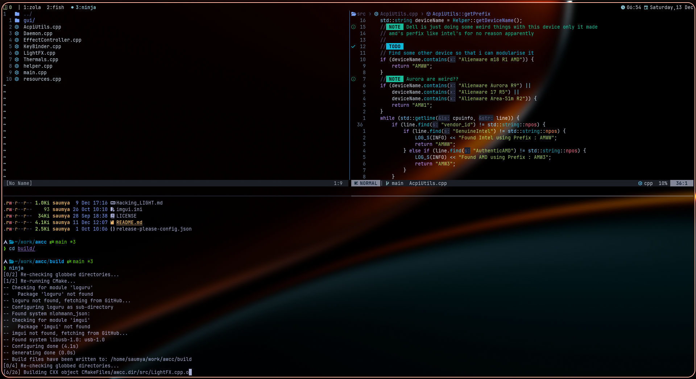
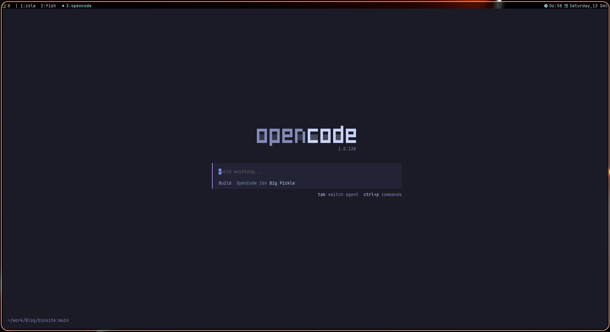

+++
title = "मेरा dev सेटअप आपसे बेहतर है"
description = "मेरे dev वातावरण और वर्कफ़्लो के बारे में गहरी जानकारी"
authors = [ "tr1x_em" ]
draft = false

[taxonomies]
tags = [ "devlog", "dev" ]

[extra]
accent_color = [ "orange", "hsl(184 100% 62.2%)" ]
banner = "banner.png"
banner_pixels = false

[extra.fediverse]
id = "115712672665196586"
+++

इस ब्लॉग में, मैं अपने dev सेटअप और वर्कफ़्लो के बारे में बात करूँगा। यह <small>(थोड़ा सा) </small> [Primagen's Course](https://frontendmasters.com/courses/developer-productivity-v2/) से प्रेरित है।

संक्षेप में (TL;DR): यहाँ मेरी dotfiles रिपॉजिटरी है: [Link](https://github.com/tr1xem/dotfiles)

## Dotfiles प्रबंधन

Dotfiles क्या हैं? खैर _dotfiles यूनिक्स-आधारित सिस्टम (जैसे Linux और macOS) पर छिपी हुई कॉन्फ़िगरेशन फ़ाइलें होती हैं, जो विभिन्न एप्लिकेशन, टूल्स और सिस्टम वातावरण के लिए सेटिंग्स, प्राथमिकताएं और कॉन्फ़िगरेशन को संग्रहीत करती हैं।_ इसका मतलब है कि यदि आप अपने dotfiles को एक डिवाइस से दूसरे डिवाइस पर ट्रांसफर कर सकते हैं, तो आपका पूरा कॉन्फ़िगरेशन (थीम्स सहित) वैसा ही रहना चाहिए।

Dotfiles प्रबंधन के लिए, मैं [GNU Stow](https://www.gnu.org/software/stow) का उपयोग करता हूँ। यह बस एक सरल काम करता है, यह फ़ाइलों का उनके वास्तविक डायरेक्टरी में सिमलिंक (symlink) बना देता है। उदाहरण के लिए, मैंने अपनी <mark>.config</mark> को <mark>~/dotfiles/config/.config</mark> के अंदर संग्रहीत किया है <small>(वैसे dotfiles एक git रेपो है)</small>। stow क्या करता है कि वह वहां से फ़ाइलों <mark>~/dotfiles/config/.config</mark> को लेता है और उन्हें उनके वास्तविक स्थान यानी <mark>~/.config/</mark> पर सिमलिंक कर देता है। इसलिए जब भी मैं कोई कॉन्फ़िगरेशन अपडेट करता हूँ, वह हमेशा <mark>~/dotfiles</mark> में संग्रहीत होता है, जो कि एक git रेपो होने के कारण मुझे अपने पूरे फ़ोल्डर का GitHub पर बैकअप लेने की क्षमता देता है।

यदि आप stow के बारे में अधिक जानना चाहते हैं तो मैं आपको निम्नलिखित वीडियो देखने की सलाह देता हूँ

{{ youtube(id="NoFiYOqnC4o") }}

यहाँ मेरी dotfiles रिपॉजिटरी है: [Link](https://github.com/tr1xem/dotfiles)

## टिलिंग विंडो मैनेजर का उपयोग क्यों करें?

<fig>
 

<figcaption>Flux</figcaption>
</fig>

_डेस्कटॉप वातावरण एक ग्राफिकल यूजर इंटरफेस (GUI) है जो ऑपरेटिंग सिस्टम के ऊपर चलता है, और उपयोगकर्ताओं को सिस्टम के साथ इंटरैक्ट करने के लिए एक नेत्रहीन सहज तरीका प्रदान करता है।_

मैं टिलिंग विंडो मैनेजर पसंद करता हूँ, क्यों? क्योंकि वे मेरे लिए विंडो को प्रबंधित करने का बोझ कम कर देते हैं, और आमतौर पर यह कीबोर्ड द्वारा संचालित होता है। जैसा कि आप जानते हैं, आप माउस की आवश्यकता को जितना कम करेंगे, आपका वर्कफ़्लो उतना ही उत्पादक और सहज होगा।

मैं [Hyprland](https://hypr.land/) का उपयोग करता हूँ, क्यों? क्योंकि पहले तो यह एक टिलिंग WM है, और दूसरा इसमें बेहतरीन कस्टमाइज़ेशन है और यह देखने में अच्छा लगता है <small>(वैसे मुझे ब्लर बहुत पसंद है)</small> लेकिन आपकी पसंद का कोई भी टिलिंग wm पर्याप्त होगा। और नहीं, मुझे Wayland बनाम Xorg से कोई फर्क नहीं पड़ता, मैंने अतीत में sway, i3, DWM का उपयोग किया है, और बात बस इतनी है कि मुझे एक अच्छा दिखने वाला डेस्कटॉप चाहिए <small>(जैसा कि आप बैनर में देख सकते हैं)</small>। फोटो की बात करें तो, यह मेरा अपना शेल है जिसे [Flux](https://github.com/tr1xem/flux) कहा जाता है, जो [Ignis](https://github.com/ignis-sh/ignis) में बनाया गया है। यह मेरी पसंद के अनुसार अनुकूलित है, लेकिन हाँ यह अच्छा दिखता है (विशेषकर डेप्थ इफेक्ट)। यदि आप एक नए उपयोगकर्ता हैं, तो मैं आपको [Hyprland's Wiki](https://wiki.hypr.land/) पढ़ने की सलाह दूँगा क्योंकि यह सरल और स्पष्ट है <small>(और अच्छा दिखता है)</small>

#### मैं शेल में क्या देखता हूँ?

इसे यह भी कहा जा सकता है कि मैंने flux क्यों बनाया, मेरे पास 15.6 इंच की डिस्प्ले है <small>(जो काफी औसत है)</small> और मेरी स्क्रीन पर उपलब्ध सभी जगह का अधिकतम उपयोग करने के लिए मुझे एक ऐसे बार की आवश्यकता है जो छोटा हो लेकिन महत्वपूर्ण चीजें दिखाए। साथ ही, मुझे नीचे बार होने का विचार पसंद नहीं है; कल्पना करें कि आपके सबसे करीब एक बार है जो आपको घूर रहा है, यह मुझे विंडोज जैसा अनुभव देता है। इसके अलावा, इसमें सभी नेटवर्क और विविध नियंत्रण इन-बिल्ट हैं, इसलिए मुझे यह सब प्रबंधित करने के लिए किसी बाहरी ऐप की आवश्यकता नहीं है।

## टूल्स

अब मैं उन टूल्स की सूची दूँगा जिनका मैं दैनिक आधार पर उपयोग करता हूँ।<small>(उनसे संबंधित सभी कॉन्फ़िगरेशन मेरी dotfiles रेपो में हैं)</small>

### एडिटर: Neovim क्यों?

<fig>
 

<figcaption>Neovim</figcaption>
</fig>

मैं व्यक्तिगत रूप से [Neovim](https://neovim.io/) का उपयोग करता हूँ क्योंकि यह vim है <small> (और vim मूवमेंट्स)</small> और इसके ऊपर, यह बहुत सारे प्लगइन्स के साथ अत्यधिक कस्टमाइज़ करने योग्य है।
यदि आप मुझसे पूछें, तो वह एक चीज क्या है जिसने मेरे dev अनुभव को 100 गुना बेहतर बना दिया? यह Vim मूवमेंट्स को सीखना है, और उत्पादकता वाले हिस्सों के अलावा, यह वास्तव में कोड लिखने को एक सुखद अनुभव बनाता है। शुरुआत में vim मूवमेंट्स सीखना थोड़ा भारी लग सकता है लेकिन मेरा विश्वास करें, यह 100% सार्थक है। सीखने के लिए, मैं theprimagen द्वारा इस प्लेलिस्ट [Vim as your editor](https://www.youtube.com/watch?v=X6AR2RMB5tE&list=PLm323Lc7iSW_wuxqmKx_xxNtJC_hJbQ7R) को देखने का सुझाव दूँगा।

### टर्मिनल मल्टीप्लेक्सर: Tmux क्यों?

<fig>
 

<figcaption>Tmux</figcaption>
</fig>

_एक टर्मिनल मल्टीप्लेक्सर एक सॉफ्टवेयर एप्लिकेशन है जो कई स्यूडो-टर्मिनल-आधारित लॉगिन सत्रों को एक एकल टर्मिनल डिस्प्ले, टर्मिनल एमुलेटर विंडो, या रिमोट लॉगिन सत्र के भीतर मल्टीप्लेक्स करने की अनुमति देता है।_

मूल रूप से, यह आपको एक से अधिक नॉन-वोलेटाइल सत्र बनाने देता है <small>(टर्मिनल बंद होने पर भी सत्र बंद नहीं होंगे)</small>। आप सोच रहे होंगे कि सिर्फ अलग विंडो का उपयोग क्यों न करें? खैर, हाँ आप कर सकते हैं, लेकिन क्या होगा यदि आपको एक साथ नौ विंडो की आवश्यकता हो? यहीं पर tmux काम आता है, आप एक ही टर्मिनल में रहते हुए जितनी चाहें उतनी शेल (या विंडो) रख सकते हैं। एक और उपयोग का मामला यह है कि यदि आप किसी VPS में ssh'd हैं, तो क्या होगा यदि आपको एक से अधिक शेल की आवश्यकता है? आपको अलग टर्मिनल विंडो से ssh करना होगा, लेकिन यदि आप tmux का उपयोग करते हैं तो एक ही ssh लॉगिन इसे कर सकता है, और यह बैकग्राउंड में भी चल सकता है इसलिए आपको screen जैसे किसी चीज की आवश्यकता नहीं होगी। साथ ही, आप पेन को स्प्लिट कर सकते हैं और री-ऑर्डरिंग जैसी चीजें कर सकते हैं और अधिक सत्र बना सकते हैं, जिसने इसे मेरे वर्कफ़्लो का एक मुख्य हिस्सा बना दिया है। यदि आप tmux के बारे में अधिक जानना चाहते हैं, तो Dreams of Code का इस पर एक बेहतरीन [वीडियो](https://www.youtube.com/watch?v=DzNmUNvnB04) है।

### AI सहायता: Opencode और Supermaven

<fig>
 

<figcaption>Opencode</figcaption>
</fig>

व्यक्तिगत रूप से, मुझे डेवलपमेंट में AI का उपयोग करना पसंद नहीं है, क्योंकि मुझे नहीं लगता कि हम उस स्तर पर हैं जहाँ AI विश्वसनीय कोड लिख सके। न तो मैं <mark>Vibe Coding</mark> के विचार का समर्थन करता हूँ और न ही मुझे यह पसंद है। लेकिन अन्य समय में जैसे कि एक सामान्य bash स्क्रिप्ट बनाने या व्याकरण संबंधी गलतियों का पता लगाने के लिए, मुझे लगता है कि [Opencode](https://opencode.ai/) सबसे अच्छा है, यह ओपन सोर्स है, डेवलपर बहुत मिलनसार है, और यह मॉडल से बंधा नहीं है, जिसका अर्थ है कि आप किसी भी मॉडल का उपयोग कर सकते हैं, यहाँ तक कि अपना स्थानीय LLM भी ला सकते हैं।

मुझे व्यक्तिगत रूप से आपके एडिटर के अंदर AI का विचार पसंद नहीं है, जैसे कि आपके एडिटर का आधा हिस्सा प्रॉम्प्ट्स और ऐसी चीजों से भरा हो, मैं एडिटर के बाहर और टर्मिनल-आधारित एजेंट को प्राथमिकता देता हूँ ताकि मैं इसके लिए एक विंडो बनाने के लिए बस tmux का उपयोग कर सकूँ। यह सिर्फ मेरी एडिटर और एजेंटों को अलग रखने की प्राथमिकता है, और मुझे लगता है कि ज्यादातर लोगों के पास यही है?<small>(जब तक कि वे वाइब कोडिंग नहीं कर रहे हों?)</small>

जो चीज मुझे अपने एडिटर के अंदर पसंद है वह AI-आधारित ऑटो-कंप्लीट है, यह ज्यादातर जगहों पर काम आता है। मैं व्यक्तिगत रूप से [Supermaven](https://supermaven.com/) का उपयोग करता हूँ क्योंकि यह तेज़, मुफ़्त और सटीक है <small>(ज्यादातर समय)</small> और उनके पास एक Neovim प्लगइन भी है, इसीलिए भी।

### टर्मिनल: Ghostty

मुझे इसकी ज्यादा परवाह नहीं है, मैं बस [Ghostty](https://ghostty.org/) का उपयोग करता हूँ। मुझे नहीं लगता कि यह कोई अंतर पैदा करता है, वे सभी एक समान हैं।

### Hyprscrolling

<fig>
{{ video(url="scrolling.webm", alt="Scrolling Layout",autoplay=true,controls=false,loop=true,muted=true) }}
<figcaption>Scrolling Layout</figcaption>
</fig>

मैं Hyprland में स्क्रॉलिंग विंडो मैनेजर की सुविधाओं को जोड़ने के लिए [Hyprscrolling](https://github.com/hyprwm/hyprland-plugins/tree/main/hyprscrolling) प्लगइन का उपयोग करता हूँ। मुझे इसे उपयोग किए हुए एक महीना हो गया है और यह बहुत अच्छा है। लेकिन यह पूरी तरह से प्राथमिकताओं पर निर्भर करता है, मुझे यह पसंद है।

## कंटेनर-आधारित डेवलपमेंट

अब यह मैंने हाल ही में सीखा है, और यह पहले से ही मेरे वर्कफ़्लो का एक मुख्य हिस्सा है

यदि आप [Systemd](https://en.wikipedia.org/wiki/Systemd) का उपयोग करते हैं तो यह [Systemd-nspawn](https://wiki.archlinux.org/title/Systemd-nspawn) के साथ आता है जो तकनीकी रूप से एक न्यूनतम Linux डिस्ट्रिब्यूशन (हेडलेस) बनाता है जिसे मैं कहूँगा कि यह आपके डिस्ट्रो का एक अलग हिस्सा है। यह chroot कमांड की तरह है, लेकिन यह स्टेरॉयड पर chroot है। कंटेनरों का उपयोग करके, मैं होस्ट सिस्टम को न्यूनतम रख सकता हूँ और साथ ही विभिन्न कार्यों के लिए अलग, अच्छी तरह से संगठित वातावरण बनाए रख सकता हूँ। यदि आप इसके बारे में अधिक जानना चाहते हैं, तो आप [Gaspar's](https://gasparvardanyan.github.io/blog/arch-workstation-3/) के ब्लॉग को देख सकते हैं कि वह अपने डेवलपमेंट कंटेनरों को कैसे प्रबंधित करता है।<small>(उन्हें श्रेय जाता है क्योंकि उन्होंने मुझे भी यही सिखाया है)</small>

### उल्लेखनीय उल्लेख: गैर-विकास टूल्स

- [FFmpeg](https://ffmpeg.org) - अब तक का सबसे महान टूल
- [Tealdeer](https://github.com/tealdeer-rs/tealdeer) - मैन पेज बहुत लंबे हैं
- [Cppman](https://github.com/aitjcize/cppman) - सभी CPP मैन पेज ऑफ़लाइन
- [Curd](https://github.com/Wraient/curd) - मैं इसका उपयोग हर बार करता हूँ जब मुझे एनीमे देखना होता है, वास्तव में सबसे अच्छा।
- [Vicinae](https://github.com/vicinaehq/vicinae) - लिनक्स के लिए Raycast, बस इसे आज़माएं

### निष्कर्ष

यदि आप मुझसे पूछें कि आपको इसमें से कौन सी दो शीर्ष चीजें अपनानी चाहिए, तो मैं कहूँगा vim मूवमेंट्स सीखना <small>(सिर्फ मूवमेंट्स, Neovim नहीं)</small> और tmux, वे अकेले ही आपके वर्कफ़्लो में भारी सुधार करेंगे।

यदि आपके पास कोई सुझाव है या ऐसे टूल्स हैं जिनका आप हर दिन उपयोग करते हैं, तो मुझे बताएं, शायद मैं भी उनका उपयोग कर सकूँ??

और मेरा सेटअप शायद आपसे बेहतर न हो <small>(या हो सकता है)</small> लेकिन यह निश्चित रूप से मेरे लिए एकदम सही है 😉
