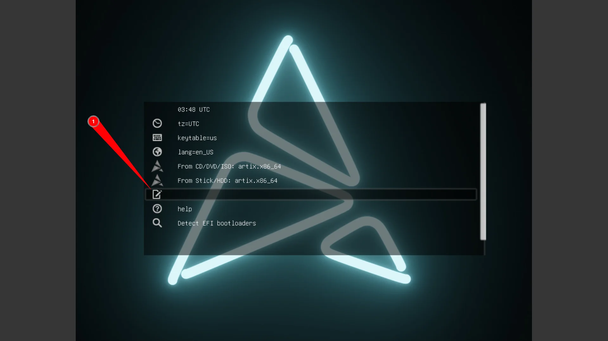
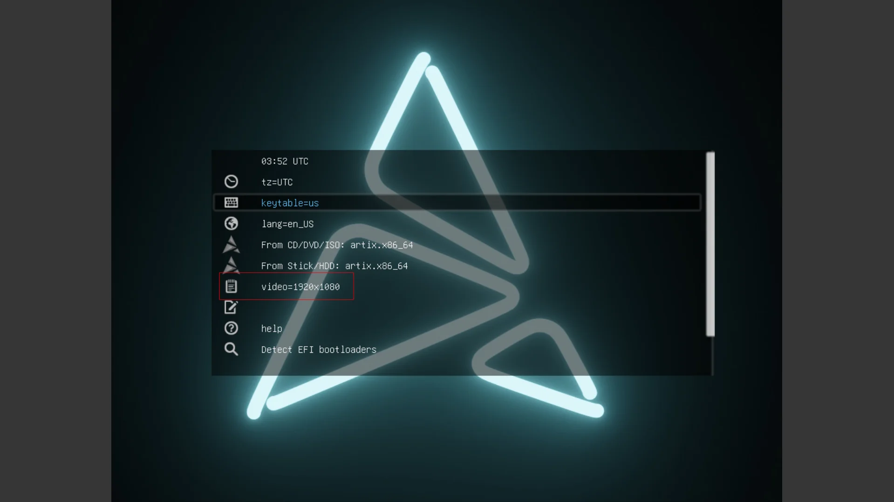

+++
title = "Artix The CHAD WAY"
description = "Install artix with zfs and zfsbootmenu THEE CHAD WAY"
authors = [ "tr1x_em" ]
draft = false
+++

# Setting up boot options





# Setting up the ssh

```bash
sudo -i # Become root

echo "PermitRootLogin yes" >> /etc/ssh/sshd_config

rc-service sshd start # Started the ssh service

ip -4 address show scope global # would show the ip

ssh root@192.168.1.10 # SSH into the account
```

# Adding ZFS Repo

```bash
sed -i 's/#ParallelDownloads/ParallelDownloads/' /etc/pacman.conf
# Add zfs arch repo to /etc/pacman.conf
tee -a $INST_MNT/etc/pacman.conf << 'EOF'
[archzfs]
# TODO: Change this to `Required` once it's announced that the signing system is finalized.
SigLevel = Never
Server = https://github.com/archzfs/archzfs/releases/download/experimental
EOF
pacman -Sy --noconfirm archzfs-dkms && modprobe zfs
```

# Setting up vars for smooth installation

```plain
INST_TZ=/usr/share/zoneinfo/Asia/Kolkata
INST_HOST='artix' # Put your host name here
INST_OS='artixlinux'
INST_LINVAR='linux-zen'
INST_MNT=/mnt
```

Would suggest setting pacman parallel download to something like 5-8
Now partion and we need 2 parts

part1  = EFI (512mb as its only needed for zfs bootmenu)
part2= Root (greater than 20gb)

Example of good partion

```plain
Device       Start      End  Sectors  Size Type
/dev/sda1     2048  1050623  1048576  512M EFI System
/dev/sda2  1050624 83884031 82833408 39.5G Solaris root
```

```bash
DISK=/dev/disk/by-id/nvme-foo_NVMe_bar_512GB
DISK_BOOT=${DISK}-part1
DISK_ROOT=${DISK}-part2
```

# Formatting partions

Format the bootpartion

```plain
 mkfs.fat -n BOOT $DISK_BOOT
```

## Setting up the root partion (with encrpytion)

```plain
zgenhostid # Generate a host id
echo '<passphrase>' > /etc/zfs/rpool.key
chmod 000 /etc/zfs/rpool.key


 zpool create \
      -o ashift=12 \
      -O acltype=posixacl \
      -O canmount=off \
      -O compression=zstd \
      -O dnodesize=auto \
      -O normalization=formD \
      -O relatime=on \
      -O xattr=sa \
      -O mountpoint=/ \
      -R $INST_MNT \
      -O encryption=aes-256-gcm \
      -O keylocation=file:///etc/zfs/rpool.key \
      -O keyformat=passphrase \
      rpool  \
      $DISK_ROOT
```

keylocation is needed if u want a smooth boot experince and not put in password 2 times

Create container datasets:

```plain
zfs create -o canmount=off -o mountpoint=none rpool/ROOT
zfs create -o canmount=off -o mountpoint=none rpool/DATA
```

```plain
 zfs create -o mountpoint=/ -o canmount=noauto rpool/ROOT/$INST_OS
```

 Mount root filesystem dataset and boot partition:

```plain
zfs mount rpool/ROOT/$INST_OS
mkdir -p $INST_MNT/boot/efi
mount $DISK_BOOT $INST_MNT/boot/efi
```

Important to not mount to base boot partion as it would let u have a unbootable installation

 Create datasets to separate user data from root filesystem:

```plain
zfs create -o mountpoint=/ -o canmount=off rpool/DATA/$INST_OS

for i in {usr,var,var/lib};
do
	zfs create -o canmount=off rpool/DATA/$INST_OS/$i
done

for i in {home,root,srv,usr/local,var/log,var/spool,var/tmp};
do
	zfs create -o canmount=on rpool/DATA/$INST_OS/$i
done

chmod 750 $INST_MNT/root
chmod 1777 $INST_MNT/var/tmp
```

Now you should be ending up with a structure something like

```plain
artix-live:[root]:/mnt# zfs list
NAME                              USED  AVAIL  REFER  MOUNTPOINT
rpool                            4.02M  37.8G   192K  /mnt
rpool/DATA                       2.25M  37.8G   192K  none
rpool/DATA/artixlinux            2.06M  37.8G   192K  /mnt
rpool/DATA/artixlinux/home        192K  37.8G   192K  /mnt/home
rpool/DATA/artixlinux/root        192K  37.8G   192K  /mnt/root
rpool/DATA/artixlinux/srv         192K  37.8G   192K  /mnt/srv
rpool/DATA/artixlinux/usr         384K  37.8G   192K  /mnt/usr
rpool/DATA/artixlinux/usr/local   192K  37.8G   192K  /mnt/usr/local
rpool/DATA/artixlinux/var         960K  37.8G   192K  /mnt/var
rpool/DATA/artixlinux/var/lib     192K  37.8G   192K  /mnt/var/lib
rpool/DATA/artixlinux/var/log     192K  37.8G   192K  /mnt/var/log
rpool/DATA/artixlinux/var/spool   192K  37.8G   192K  /mnt/var/spool
rpool/DATA/artixlinux/var/tmp     192K  37.8G   192K  /mnt/var/tmp
rpool/ROOT                        568K  37.8G   192K  none
rpool/ROOT/artixlinux             376K  37.8G   376K  /mnt
```

NOTE: i use osname as if u wanna boot another os but on same disk u could do that (yeah its possible and its easy lmk if you want a tutorial

## Package installation

```plain
basestrap $INST_MNT base vim grub connman connman-openrc openrc elogind-openrc
```

then install

```plain
basestrap $INST_MNT $INST_LINVAR $INST_LINVAR-headers archzfs-dkms sudo efibootmgr wget
# If your computer has hardware that requires firmware to run
basestrap $INST_MNT linux-firmware sof-firmware
```

```plain
cp /etc/hostid /mnt/etc
cp /etc/resolv.conf /mnt/etc
mkdir /mnt/etc/zfs   # plese ignore if you get prompted it already exists
cp /etc/zfs/rpool.key /mnt/etc/zfs
cp /etc/pacman.conf /mnt/etc/pacman.conf
cp /etc/resolv.conf $INST_MNT/etc/resolv.conf
echo $INST_HOST > $INST_MNT/etc/hostname
ln -sf $INST_TZ $INST_MNT/etc/localtime
echo "en_US.UTF-8 UTF-8" >> $INST_MNT/etc/locale.gen
echo "LANG=en_US.UTF-8" >> $INST_MNT/etc/locale.conf
```

No kernel installation because we have to install linux-cachyos as it comes with zfs pre installed and openzfs supports max kernel ver as 6.1

Setup mount points

```plain
fstabgen -U $INST_MNT | grep "/boot/EFI" >> $INST_MNT/etc/fstab
```

ZFS dont need other mount points it manages them internally it only need efi

```plain
echo $INST_HOST > $INST_MNT/etc/hostname
 ln -sf $INST_TZ $INST_MNT/etc/localtime
echo "en_US.UTF-8 UTF-8" >> $INST_MNT/etc/locale.gen
echo "LANG=en_US.UTF-8" >> $INST_MNT/etc/locale.conf
```

# Chrooting and setting it up

Chroot:

```plain
artix-chroot $INST_MNT /usr/bin/env DISK=$DISK DISK_ROOT=$DISK_ROOT \
	DISK_BOOT=$DISK_BOOT INST_UUID=$INST_UUID bash --login
```

Generate locales:
locale-gen

Generate zpool.cache:

```sh
zpool set cachefile=/etc/zfs/zpool.cache rpool
```

Set the root password:

```sh
passwd
```

Setting up cachyos repos:

```sh
sudo pacman-key --recv-keys F3B607488DB35A47 --keyserver keyserver.ubuntu.com
sudo pacman-key --lsign-key F3B607488DB35A47

sudo pacman -U 'https://mirror.cachyos.org/repo/x86_64/cachyos/cachyos-keyring-20240331-1-any.pkg.tar.zst' \
'https://mirror.cachyos.org/repo/x86_64/cachyos/cachyos-mirrorlist-22-1-any.pkg.tar.zst' \
'https://mirror.cachyos.org/repo/x86_64/cachyos/cachyos-v3-mirrorlist-22-1-any.pkg.tar.zst' \
'https://mirror.cachyos.org/repo/x86_64/cachyos/cachyos-v4-mirrorlist-22-1-any.pkg.tar.zst' \
'https://mirror.cachyos.org/repo/x86_64/cachyos/pacman-7.1.0.r9.g54d9411-2-x86_64.pkg.tar.zst'
```

Then add

```ini
# If your CPU only supports x86-64, then add the [cachyos] repositories
# cachyos repos
[cachyos]
Include = /etc/pacman.d/cachyos-mirrorlist

# If your CPU supports x86-64-v3, then add [cachyos-v3],[cachyos-core-v3],[cachyos-extra-v3] and [cachyos]
# cachyos repos

[cachyos-v3]
Include = /etc/pacman.d/cachyos-v3-mirrorlist
[cachyos-core-v3]
Include = /etc/pacman.d/cachyos-v3-mirrorlist
[cachyos-extra-v3]
Include = /etc/pacman.d/cachyos-v3-mirrorlist
[cachyos]
Include = /etc/pacman.d/cachyos-mirrorlist

# If your CPU supports x86-64-v4, then add [cachyos-v4], [cachyos-core-v4], [cachyos-extra-v4] and [cachyos]
# cachyos repos

[cachyos-v4]
Include = /etc/pacman.d/cachyos-v4-mirrorlist
[cachyos-core-v4]
Include = /etc/pacman.d/cachyos-v4-mirrorlist
[cachyos-extra-v4]
Include = /etc/pacman.d/cachyos-v4-mirrorlist
[cachyos]
Include = /etc/pacman.d/cachyos-mirrorlist

# If your CPU is based on Zen 4 or Zen 5, add [cachyos-znver4], [cachyos-core-znver4], [cachyos-extra-znver4] and [cachyos]

[cachyos-znver4]
Include = /etc/pacman.d/cachyos-v4-mirrorlist
[cachyos-core-znver4]
Include = /etc/pacman.d/cachyos-v4-mirrorlist
[cachyos-extra-znver4]
Include = /etc/pacman.d/cachyos-v4-mirrorlist
[cachyos]
Include = /etc/pacman.d/cachyos-mirrorlist
```

Install kernel and headers

```sh
pacman -S linux-cachyos linux-cachyos-headers
```

NOTE: ZFS SHOULD BE BEFORE FILE SYSTEM else you would get rootfs error

and then add your keyfile to mkinctopi

```plain
FILES=(/etc/zfs/rpool.key)
```

Regenrate intrafms

mkinitcpio -P

Make a user for youself

```plain
useradd -m -G wheel -s /bin/bash trix
passwd trix
```

Then edit visudo file

```plain
EDITOR=vim visudo
```

Uncomment:

```plain
%wheel ALL=(ALL:ALL) ALL
```

and switch to that user

```plain
su - trix
```

Setup the zfs service

```plain
git clone https://gitlab.com/aur3675443/zfs-openrc
cd zfs-openrc
sudo cp zfs-* /etc/init.d/
chmod +x /etc/init.d/zfs-*
```

Then activate the service

```plain
sudo rc-update add zfs-import boot ## (This is needed!)
sudo rc-update add zfs-load-key boot ## (Only if you need it!)
sudo rc-update add zfs-zed boot ## (This is needed!)
sudo rc-update add zfs-mount boot ## (THIS IS IMPORTANT!! Otherwise the zpool(s) will be imported but not mounted!)
```

## Setting up zbm

```plain
sudo zpool set bootfs=rpool/ROOT/artixlinux rpool
```

Now setup boot commands

```plain
sudo zfs set org.zfsbootmenu:commandline="noresume init_on_alloc=0 rw spl.spl_hostid=$(hostid) video=1920x1080" rpool/ROOT
```

Now setting up efi

```plain
sudo su
mkdir -p /boot/efi/EFI/zbm
wget https://get.zfsbootmenu.org/latest.EFI -O /boot/efi/EFI/zbm/zfsbootmenu.EFI
efibootmgr --disk /dev/sda --part 1 --create --label "ZFSBootMenu" --loader '\EFI\zbm\zfsbootmenu.EFI' --unicode "spl_hostid=$(hostid) zbm.timeout=3 zbm.prefer=rpool zbm.import_policy=hostid video=1920x1080" --verbose
```

NOTE CHANGE the var in commad to ur linking `/dev/sda` should be disk not part while part is the part in which efi is

## Exit and clean up

```plain
exit
umount /mnt/boot/efi
zpool export rpool
reboot
```
