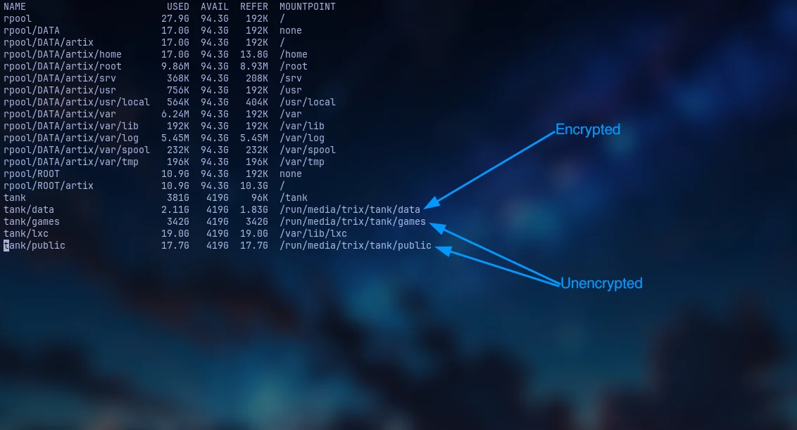

+++
title = "Install Artix on ZFS THE CHAD WAY"
description = "Install Artix on ZFS with ZFSBootMenu"
authors = [ "tr1x_em" ]
draft = false

[taxonomies]
tags = [ "linux", "devlog" ]
categories = [ "Featured" ]

[extra]
accent_color = [ "hsl(270 13% 48%)", "hsl(290 20% 71%)" ]
banner = "banner.png"
banner_pixels = false
disclaimer = "This page contains blackjack and hookers, and bad jokes such as this one."

[extra.fediverse]
host = "mastodon.social"
user = "tr1x_em"
id = "116396462736866565"
+++

# Introduction

So it happened like always i woke up one day and decided that life isn't really fun **I SHOULD DO SOMETHING DIFFERENT** and as I had lot of free time(the most important requirement for installing Linux is basically being unemployed ~~jk~~) I decided making the most chad Linux setup that ever exist and it would be Artix with ZFS[^1] you may ask why? That's what we would find in next section and if you dont wanna hear my yap you can directly skip to [Installation](#installation) section {{ demoji(name="xdd") }} .

## Motivation


If you don't know the systemd controversy (well congratulations you have a job and a real life) Its just people don't really like systemd , most of the folks take it as an init system[^2] but instead its like a glob of pretty much everything which includes networking, containers(somehow but its true) etc. Basically we can say systemd isn’t just an init system—it’s a platform, and that’s exactly why people argue it breaks the Unix philosophy which says "Do one thing and do it well" so instead of you getting "one tool per job" you get "one ecosystem for many jobs" <small>which some of you can think is a good thing i don't know what to tell you to be honest</small> {{ demoji(name="dumb") }} . You can read more about it on [nosystemd](https://nosystemd.org/) <small>PS: its major contributor is redhat iykyk</small>

And as I have previously mentioned my friend Gaspar[^3] suggested (or you can say motivated) me to make the switch and yeah OFC MY ARCH INSTALLATION WAS BADLY BLOATED {{demoji(name="facecry")}}

All of this lead to my journey of wasting a week reading 69+ wiki's just to know how does ZFS even works...<small>and yeah i still failed many times after it</small>

## Why ZFS and not BTRFS?

ZFS is a file system with volume management capabilities which means no more fixed size disk partitions yayyyyyyyyyyyy (you get this in btrfs too btw) but the thing what i wanted was encryption...alright i hear someone shouting LUKS but LISTEN HERE YOU , ZFS supports native encryption which gives you pretty badass freedom to manage your data. Like you can have a unencrypted pool named `tank` and have a dataset `games` which is unencrypted but in same pool you could have `personal` dataset which would be encrypted.. which for me was mind blowing I could just have a unencrypted pool which some encrypted dataset to have my data.

Other features like self healing ,raids and snapshots you can pretty much find anywhere but for me the native encryption was the main feature i was looking for

Well some of you may argue that zfs module dosen't even come in the linux kernel by default its bad V: well then use whatever you like i dont mind <small>as long as its linux (tho we wont call you cool here)</small> {{ demoji(name="laughers") }} . And for people wondering ZFS will never be integrated into the Linux kernel due to it's licence.

## Why Artix and not Arch?


Because Luke Smith[^4] said in this [video](https://www.youtube.com/watch?v=SVc6n5aOzy0) that Artix users are superior than arch users {{ demoji(name="smart") }}

## ZFS Drawbacks


ZFS is an out-of-tree dkms module, and while people use it due to it's features and because of that, you should not ask support on Arch/Artix Linux forums.


The following information is taken from [Nwildner's](https://nwildner.com/posts/2025-09-03-zfs-setup/) post as he had compiled everything in a great way

Most of the disadvantages of using `ZFS` on Linux are higlighted on [this](https://wiki.archlinux.org/title/Dm-crypt/Encrypting_an_entire_system) Arch Wiki article, but, let’s reiterate them:

- ZFS does not encrypt metadata, meaning some basic structures of your pool like dataset, snapshot names, snapshot hierarchy, and deduplication tables (although deduplicated data is encrypted) might be visible with the adequate tools.
- Pool creation requires knowledge of disk geometry. With nvmes, some of the pain point for tuning are gone, but not all of them.
  Swap inside a zvol is not possible and it is an [old and well-known issue](https://github.com/openzfs/zfs/issues/7734) and you should avoid using it as well as using swapfiles inside ZFS.
- ZFS has some caveats due to it’s implementation of aes for cryptography and had some performance issues in the past that are now fixed. They had to implement their own mechanisms since they can’t touch kernel algorithms because the module is not licensed as GPL.
- out-of-tree kernel module. Pretty obvious but, if you don’t want any surprises like your module not being added to the initramfs, pay attention during kernel install procedures or just use `linux-lts` for better compatibility.
- If you are a laptop user, disable hibernate(suspend to disk) entirely. Waking your laptop, importing your zfs pool and after that bringing data that is hibernate from swap back to your disk will likely [break your zfs pool](https://github.com/openzfs/zfs/issues/260#issuecomment-991912492).

> [!NOTE]
> I would only recommend you installing ZFS if you got atleast 16gb of ram as the ram usage for ZFS is higher than a normal traditional file system.

So now you know the caveats lets get into the process of installing it.

For me I would be installing Artix with Open-rc on ZFS you can adapt this to pretty much any init system.
**PS:** I myself had install artix reading this guide.

# Installation


## Setting up the SSH service

```bash
sudo -i # Become root
echo "PermitRootLogin yes" >> /etc/ssh/sshd_config
rc-service sshd start # Started the ssh service
ip -4 address show scope global # would show the ip
ssh root@192.168.1.10 # SSH into the account
```

## Adding arch archzfs repo

```bash
# Would make installation faster by increasing parallel download
sed -i 's/#ParallelDownloads/ParallelDownloads/' /etc/pacman.conf
# Add zfs arch repo to /etc/pacman.conf
tee -a /etc/pacman.conf << 'EOF'
[archzfs]
# TODO: Change this to `Required` once it's announced that the signing system is finalized.
SigLevel = Never
Server = https://github.com/archzfs/archzfs/releases/download/experimental
EOF
pacman -Sy --noconfirm archzfs-dkms && modprobe zfs
```

## Setting up env variables for smooth installation

```bash
# timezone
INST_TZ=/usr/share/zoneinfo/Asia/Kolkata
# Hostname
INST_HOST='artix'
INST_OS='artixlinux'
# Mount point
INST_MNT=/mnt
```

Choose which kernel you want to install:

- linux
- linux-lts
- linux-zen
- linux-hardened

```bash
INST_LINVAR='linux-zen'
```

## Setting up partitions

Now We need 2 partions (which you can create easily using `cfdisk`):

- `part1` = EFI (512mb as its only needed for zfsbootmenu)
- `part2`= Root (suggested to be type of solaris root)

Example of good partion:

```bash
$ fdisk -l /dev/sda
Device       Start      End  Sectors  Size Type
/dev/sda1     2048  1050623  1048576  512M EFI System
/dev/sda2  1050624 83884031 82833408 39.5G Solaris root
```

> [!NOTE]
> In your case if you use as SSD the sda1 would be nvme0n1 which parts like nvme0n1p1...p3 here p1 is part 1 and like that

Set up the disk variabled as follows

```bash
DISK=/dev/disk/by-id/nvme-foo_NVMe_bar_512GB
DISK_BOOT=${DISK}-part1
DISK_ROOT=${DISK}-part2
```

Assuming the part1 (which u saw as p1) is EFI partion and part2 is root.

## Setting up the Live ISO

```bash
# Generate a host id
zgenhostid
# Passpharase is the password it would ask to decrypt your filesystem
# assuming rpool is the name of root pool
echo '<passphrase>' > /etc/zfs/rpool.key
chmod 000 /etc/zfs/rpool.key
```

## Setting up partitions

### Setting up the root partion (with encrpytion)

```bash
zpool create \
      -o ashift=12 \
      -O acltype=posixacl \
      -O canmount=off \
      -O compression=zstd \
      -O dnodesize=auto \
      -O normalization=formD \
      -O relatime=on \
      -O xattr=sa \
      -O mountpoint=/ \
      -R $INST_MNT \
      -O encryption=aes-256-gcm \
      -O keylocation=file:///etc/zfs/rpool.key \
      -O keyformat=passphrase \
      rpool  \
      $DISK_ROOT
```

Can't explain every option but here we are creating `aes-256-gcm` encryption[^5] which would be unlocked using the key present at the keylocation , using zstd compression , using 4K sector alignment for performance and ssd correctness which `rpool` as name of the pool mounting at the `$INST_MNT` variable we set.

> [!NOTE]
> I suggest you using keylocation flag as its not unsafe your key is stored already in an encrypted disk this would just allow use to boot more smoothly into our system else you have to type your password 2 times while booting if you dont want that you can do `keylocation=prompt`

### Boot partitions

Format the boot partition to be a fat32

```plain
 mkfs.fat -n BOOT $DISK_BOOT
```

## Setting up datasets

I would be keeping my root and data in different dataset so as if i wnat to snapshot only data if could do it

Create container datasets:

```bash
zfs create -o canmount=off -o mountpoint=none rpool/ROOT
zfs create -o canmount=off -o mountpoint=none rpool/DATA
```

Now we create a dataset with the OS name you are installing Why? If in future you want to dual boot a different OS on same pool you could do that by just creating a dataset named after the OS you are installing

```bash
 zfs create -o mountpoint=/ -o canmount=noauto rpool/ROOT/$INST_OS
```

Mount root filesystem dataset and boot partition:

```bash
zfs mount rpool/ROOT/$INST_OS
mkdir -p $INST_MNT/boot/efi
mount $DISK_BOOT $INST_MNT/boot/efi
```

> [!WARNING]
> Important to not mount to boot partion to /boot as it would let u have a unbootable installation, the boot partion wont container kernel or anything you would just need it to contain `zfsbootmenu`

Create datasets to separate user data from root filesystem:

```bash
zfs create -o mountpoint=/ -o canmount=off rpool/DATA/$INST_OS

for i in {usr,var,var/lib};
do
	zfs create -o canmount=off rpool/DATA/$INST_OS/$i
done

for i in {home,root,srv,usr/local,var/log,var/spool,var/tmp};
do
	zfs create -o canmount=on rpool/DATA/$INST_OS/$i
done

chmod 750 $INST_MNT/root
chmod 1777 $INST_MNT/var/tmp
```

Now you should be ending up with a structure something like this:

```bash
artix-live:[root]:/mnt# zfs list
NAME                              USED  AVAIL  REFER  MOUNTPOINT
rpool                            4.02M  37.8G   192K  /mnt
rpool/DATA                       2.25M  37.8G   192K  none
rpool/DATA/artixlinux            2.06M  37.8G   192K  /mnt
rpool/DATA/artixlinux/home        192K  37.8G   192K  /mnt/home
rpool/DATA/artixlinux/root        192K  37.8G   192K  /mnt/root
rpool/DATA/artixlinux/srv         192K  37.8G   192K  /mnt/srv
rpool/DATA/artixlinux/usr         384K  37.8G   192K  /mnt/usr
rpool/DATA/artixlinux/usr/local   192K  37.8G   192K  /mnt/usr/local
rpool/DATA/artixlinux/var         960K  37.8G   192K  /mnt/var
rpool/DATA/artixlinux/var/lib     192K  37.8G   192K  /mnt/var/lib
rpool/DATA/artixlinux/var/log     192K  37.8G   192K  /mnt/var/log
rpool/DATA/artixlinux/var/spool   192K  37.8G   192K  /mnt/var/spool
rpool/DATA/artixlinux/var/tmp     192K  37.8G   192K  /mnt/var/tmp
rpool/ROOT                        568K  37.8G   192K  none
rpool/ROOT/artixlinux             376K  37.8G   376K  /mnt
```

## Package installation

```bash
basestrap $INST_MNT base vim grub connman connman-openrc openrc elogind-openrc
```

Install kernel and zfs kernel module:

```bash
# intel microcode is optional only install if your device support it
basestrap $INST_MNT $INST_LINVAR $INST_LINVAR-headers archzfs-dkms sudo efibootmgr wget intel-ucode
# If your computer has hardware that requires firmware to run
basestrap $INST_MNT linux-firmware sof-firmware
```

Copying our config over to the new OS:

```bash
cp /etc/hostid $INST_MNT/etc

mkdir $INST_MNT/etc/zfs   # please ignore if you get prompted it already exists
# Replace rpool with whatever your name is
cp /etc/zfs/rpool.key $INST_MNT/etc/zfs

cp /etc/pacman.conf $INST_MNT/etc/pacman.conf
cp /etc/resolv.conf $INST_MNT/etc/resolv.conf
echo $INST_HOST > $INST_MNT/etc/hostname

ln -sf $INST_TZ $INST_MNT/etc/localtime
echo "en_US.UTF-8 UTF-8" >> $INST_MNT/etc/locale.gen
echo "LANG=en_US.UTF-8" >> $INST_MNT/etc/locale.conf
```

Setup mount points

We dont need mounts of ZFS datatree's and ZFS automatically handels them using `zfs-magic`

```bash
fstabgen -U $INST_MNT | grep "/boot/efi" >> $INST_MNT/etc/fstab
```

## Chrooting into our installation

Chroot:

```bash
artix-chroot $INST_MNT
```

Generate locales:

```bash
locale-gen
```

Generate zpool.cache:

```bash
zpool set cachefile=/etc/zfs/zpool.cache rpool
```

Set the root password:

```bash
passwd
```

### Setting up Initramfs

Edit your `/etc/mkinitcpio.conf`

and add these part

```bash
# The rpool key is important to add
FILES=(/etc/zfs/rpool.key /boot/intel-ucode.img)
# Remove fsck as zfs dont really need it and also it wont let kernel compile for some reasons
HOOKS=(base udev autodetect microcode modconf kms keyboard keymap consolefont block zfs filesystems)
```

> [!CAUTION]
> `zfs` should be before `filesystems` in hooks else you would get rootfs error while booting up

Then regenrate the Initramfs

```bash
mkinitcpio -P
```

Create a new user for yourself:

```bash
useradd -m -G wheel -s /bin/bash trix
passwd trix
```

Then edit visudo file:

```bash
EDITOR=vim visudo
```

and uncomment so your user can execute sudo commands:

```plain
%wheel ALL=(ALL:ALL) ALL
```

## Setting up ZFS services

Clone the zfs-openrc repo and move the script where they need to be

```bash
git clone https://gitlab.com/aur3675443/zfs-openrc
cd zfs-openrc
cp zfs-* /etc/init.d/
chmod +x /etc/init.d/zfs-*
```

Then activate the service

```bash
rc-update add zfs-import boot ## (This is needed!)
rc-update add zfs-load-key boot ## (Only if you need it!)
rc-update add zfs-zed boot ## (This is needed!)
rc-update add zfs-mount boot ## (THIS IS IMPORTANT!! Otherwise the zpool(s) will be imported but not mounted!)
```

## Setting up Bootloader

For our kind of setup [ZFSBootMenu](https://zfsbootmenu.org/)(aka "ZBM") is the perfect option. It is a pretty neat software which manages multiple aspects of ZFS boot environments and supports ZFS native encryption. It also supports directly booting into snapshots if things went wrong.

### Setting up the ZFS boot command line

```bash
zpool set bootfs=rpool/ROOT/artixlinux rpool
```

Assuming you have the setup identical as this guide.

Now setup boot commands

```bash
zfs set org.zfsbootmenu:commandline="noresume init_on_alloc=0 rw spl.spl_hostid=$(hostid) video=1920x1080" rpool/ROOT
```

`video=1920x1080` flag should be according to whatever your screen size is.

### Installing zfsbootmenu

ZBM is also provided by [AUR](https://aur.archlinux.org/packages?O=0&K=zfsbootmenu) but it is a dead simple EFI executable and I prefer to manage it outside the package manager.

```bash
mkdir -p /boot/efi/EFI/zbm
wget https://get.zfsbootmenu.org/latest.EFI -O /boot/efi/EFI/zbm/zfsbootmenu.EFI
```

Now setting up EFI menu to have entry of ZBM assuming `disk` is sda (it should be disk not part and `part` is 1 means the first partition edit it accordingly

```bash
efibootmgr --disk /dev/sda --part 1 --create --label "ZFSBootMenu" --loader '\EFI\zbm\zfsbootmenu.EFI' --unicode "spl_hostid=$(hostid) zbm.timeout=3 zbm.prefer=rpool zbm.import_policy=hostid video=1920x1080" --verbose
```

## Exit and clean up

```bash
exit
umount /mnt/boot/efi
zpool export rpool
reboot
```

And hopefully you would now boot into your brand new artix installation.

# What's Next?

There are somethings i would like you to read about and setup on your own:

- [`zrepl`](https://zrepl.github.io/): zrepl is a one-stop, integrated solution for ZFS replication. It would allow you to create snapshots automatically so you can backup anytime things went the wrong way. Here is [my configuration](https://github.com/tr1xem/dotfiles/blob/xmonad/system/etc/zrepl/zrepl.yml)
- [`ConnMan`](https://wiki.archlinux.org/title/ConnMan): a command-line network manager which would be your main networking utitlity in artix (its pretty easy)
- [`Artix Wiki`](https://wiki.artixlinux.org/): Great resource if you want to learn about anything related to Artix
- [`zram`](https://wiki.archlinux.org/title/Zram): Linux kernel module for creating a compressed block device in RAM, very useful while using ZFS

# Conclusion

The setup we just installed is pretty much GOATED in all aspect, you are getting a systemd free OS with Native encrypted root pool I mean what else do you want?

Here is what my setup looks like:

<fig>


<figcaption>Xmonad Setup</figcaption>

</fig>

If you have read about my [Dev Setup](blog/my-dev-setup-is-better-than-yours/) you know i was a wayland user and yep I switched to X11, the switch was unavoidable.

<fig>



<figcaption>ZFS list</figcaption>

 </fig>

While all of them are on same pool only one of them is encrypted which is pretty amazing.

So thats it for today hope you learnt something new would love to hear about your setup
See you in next Blog till then take care

### Footnotes

[^1]: [ZFS](https://en.wikipedia.org/wiki/ZFS)

[^2]: [More about init systems](https://en.wikipedia.org/wiki/Init)

[^3]: [If you see me becoming a hardcore FreeBSD user {{demoji(name="troll")}} please blame him](https://gasparvardanyan.github.io)

[^4]: [More about Luke Smith](https://lukesmith.xyz)

[^5]: [AES-256-GCM: The Gold Standard of Modern Encryption](https://petadot.com/blog/aes-256-gcm)
